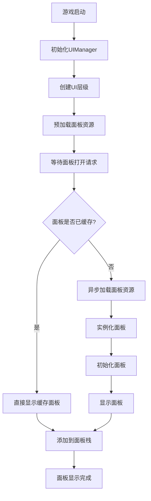

# Unity UI管理系统

## 概述

这是一个 Unity UI 管理系统，主要用于管理游戏中的各种UI面板。支持UI层级管理、面板缓存、异步资源加载和面板栈管理。

### 主要功能
- **UI层级管理**：基于枚举的UI层级分层系统
- **面板缓存**：面板实例缓存和重用机制
- **异步加载**：使用Addressables的异步资源加载
- **面板栈管理**：支持面板返回和导航功能
---

## 系统架构

### 文件结构
```
UIManagement/
├── UIManager.cs           # UI管理器。单例模式，管理所有UI面板的生命周期
└── BasePanel.cs           # 基础面板抽象类。用于被继承，实现具体的UI面板
```

### 系统流程图


---

## 主要组件

### 1. UI层级枚举 (UILayer)
- 枚举类，定义UI的显示层级
- 用于控制面板的显示顺序和层级关系

**实现例子：**
```csharp
public enum UILayer
{
    Bot,    // 底层。血条、技能条等游戏常驻UI
    Mid,    // 中层。普通面板
    Top,    // 顶层。重要提示、设置面板
    System  // 系统层。弹窗、错误提示等
}
```

### 2. 基础面板类 (BasePanel)
- 抽象基类，提供通用面板功能
- 所有UI面板都应继承此类

**主要方法：**
```csharp
public virtual void Init(params object[] args)  // 面板初始化
public virtual void OnShow()                    // 面板显示时调用
public virtual void OnHide()                    // 面板隐藏时调用
public virtual void OnUpdate()                  // 每帧更新时调用
public virtual void Close()                     // 关闭面板的方法
```

### 3. UI管理器 (UIManager)
- 单例模式管理类
- 负责面板的创建、显示、隐藏和销毁
- 管理UI层级和面板缓存

**核心存储结构：**
```csharp
private Dictionary<string, AsyncOperationHandle<GameObject>> panelAssetHandles; // 存储已加载的资源Handle
private Dictionary<string, BasePanel> panelCache;                               // 存储已创建的面板实例
private Dictionary<UILayer, RectTransform> layerDict;                           // UI的层级父节点
public Stack<BasePanel> panelStack;                                             // 面板栈，用于管理面板的返回功能
```

**主要方法：**
```csharp
public void Init()                                                         // 初始化UI管理器
public async void OpenPanel(string panelAddress, UILayer layer, object[])  // 打开面板
public void ClosePanel(string panelAddress)                                // 关闭面板
public async void PreloadPanel(string panelAddress)                        // 预加载面板资源
public T GetPanel<T>(string panelName)                                     // 获取指定面板实例
public void ClearAll()                                                     // 清理所有UI面板和资源
```

---
## 使用方法

### 1. 基本设置

1. 创建空的GameObject作为UIManager
2. 添加必要组件：
   - `UIManager` 脚本
   - 设置 `uiRoot` 为UI根节点Transform
     
### 2. 初始化流程

**在游戏启动时调用：**
```csharp
// 初始化UI管理器
UIManager.Instance.Init();
```

### 3. 创建自定义面板

**继承BasePanel：**
```csharp
public class AttributePanel : BasePanel
{
    [Header("UI组件")]
    public Text playerNameText;
    public Slider healthSlider;
    
    public override void Init(params object[] args)
    {
        // 初始化面板数据
        if (args.Length > 0)
        {
            string playerName = args[0] as string;
            playerNameText.text = playerName;
        }
    }
    
    public override void OnShow()
    {
        // 面板显示时的逻辑
        gameObject.SetActive(true);
    }
    
    public override void OnHide()
    {
        // 面板隐藏时的逻辑
        gameObject.SetActive(false);
    }
    
    public override void OnUpdate()
    {
        // 每帧更新逻辑
        // 例如：更新血条显示
    }
}
```

### 4. 使用面板

**打开面板：**
```csharp
// 打开属性面板，传递玩家名称参数
UIManager.Instance.OpenPanel("Panel_Attribute", UILayer.Mid, "玩家名称");

// 打开系统设置面板
UIManager.Instance.OpenPanel("Panel_Settings", UILayer.Top);
```

**关闭面板：**
```csharp
// 关闭指定面板
UIManager.Instance.ClosePanel("Panel_Attribute");
```

**获取面板实例：**
```csharp
// 获取属性面板实例并操作
AttributePanel panel = UIManager.Instance.GetPanel<AttributePanel>("Panel_Attribute");
if (panel != null)
{
    panel.UpdatePlayerInfo("新的玩家信息");
}
```

### 5. 预加载优化

**预加载重要面板：**
```csharp
// 在游戏加载阶段预加载常用面板
UIManager.Instance.PreloadPanel("Panel_Attribute");
UIManager.Instance.PreloadPanel("Panel_Inventory");
```

### 6. 资源清理

**在场景切换时清理：**
```csharp
// 清理所有UI面板和释放资源
UIManager.Instance.ClearAll();
```

---

## 具体案例
一个RPG游戏中的属性面板管理。

### 属性面板 (AttributePanel)
- 显示玩家的基本属性信息
- 支持实时更新数据
- 可通过按钮关闭

**逻辑：**
实现一个继承自BasePanel的AttributePanel。
```csharp
public class AttributePanel : BasePanel
{
    [Header("属性显示")]
    public Text levelText;
    public Text healthText;
    public Text attackText;
    
    private PlayerData playerData;
    
    public override void Init(params object[] args)
    {
        // 接收玩家数据
        if (args.Length > 0 && args[0] is PlayerData)
        {
            playerData = args[0] as PlayerData;
            UpdateDisplay();
        }
    }
    
    public override void OnShow()
    {
        gameObject.SetActive(true);
        // 面板显示动画等
    }
    
    public override void OnHide()
    {
        // 面板隐藏动画等
        gameObject.SetActive(false);
    }
    
    public override void OnUpdate()
    {
        // 实时更新数据显示
        if (playerData != null)
        {
            UpdateDisplay();
        }
    }
    
    private void UpdateDisplay()
    {
        levelText.text = $"等级: {playerData.level}";
        healthText.text = $"生命值: {playerData.health}/{playerData.maxHealth}";
        attackText.text = $"攻击力: {playerData.attack}";
    }
    
    // UI按钮事件
    public void OnCloseButtonClick()
    {
        Close();
    }
}
```

### 游戏控制器调用示例
- 管理UI的显示和隐藏
- 处理玩家交互

**使用流程：**
```csharp
public class GameController : MonoBehaviour
{
    public PlayerData playerData;
    
    private void Start()
    {
        // 初始化UI管理器
        UIManager.Instance.Init();
    }
    
    // 显示属性面板
    public void ShowAttributePanel()
    {
        UIManager.Instance.OpenPanel("Panel_Attribute", UILayer.Mid, playerData);
    }
    
    // 显示设置面板
    public void ShowSettingsPanel()
    {
        UIManager.Instance.OpenPanel("Panel_Settings", UILayer.Top);
    }
    
    // 场景切换时清理
    public void OnSceneChange()
    {
        UIManager.Instance.ClearAll();
    }
}
```

---

## 技术特性

### 1. Addressables资源管理
- 使用Unity Addressables系统进行异步资源加载
- 支持资源的预加载和释放
- 提高内存使用效率

### 2. 面板缓存机制
- 已创建的面板会被缓存，再次打开时直接显示
- 减少重复的实例化开销
- 提升UI响应速度

### 3. UI层级管理
- 通过枚举定义不同的UI层级
- 确保UI元素按正确顺序显示
- 支持层级间的覆盖关系

### 4. 面板栈管理
- 维护面板的打开顺序
- 支持面板的返回导航
- 便于实现面板间的跳转逻辑

---

## 版本信息

- **Unity 版本**：Unity 2022.3+ 
- **编程语言**：C#
- **依赖系统**：Unity Addressables
- **适用场景**：各类Unity游戏的UI管理

---
